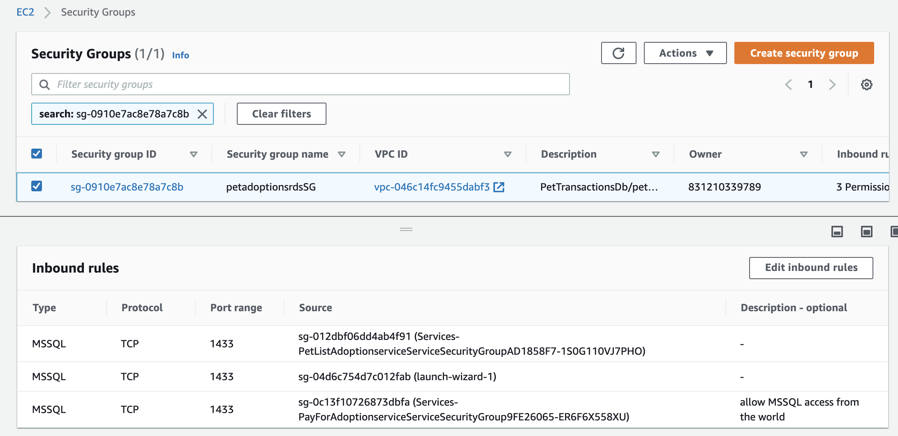

## Install Petadoption app resources

### Synthesize CDK app

```
cdk synth
```
### Bootstrap CDK 

```
cdk bootstrap
```

### Deploy the stack

> It will take a few minutes for the stack to be deployed, so just go get a ☕️

```
cdk deploy Services
```
Once complete, copy paste the values of Outputs somewhere. Or just open a new Terminal window

Execute the following command while at the pet_stack folder and follow instructions

> This is critical and is necessary for the services to function properly

```
./resources/setup_parameterstore.sh 
```

### Create SQL Server RDS database instance
As part of the CDK stack, a SQL Server RDS database instance was created. In this exercise you will be creating a SQL database inside the RDS instance and make modifications to Security Groups to allow traffic from the microservices

#### Create a Windows EC2 instance to setup the database
Choose a  free tier eligible instance as shown below and make sure you create it on a public subnet in the same VPC we created as part of the CDK deployment


Add the following Security Groups to the RDS Security Group's Inbound rules to allow MS SQL traffic.

* Security Group associated with the newly created Windows EC2 instance
* Security Group associated with ECS PayForAdoptions service
* Security Group associated with ECS PetListAdoptions service



Open the browser and install SQL Server Management Studio using this link - https://aka.ms/ssmsfullsetup 

Once installed, launch it by typing SSMS in the Start menu as shown below


Login using credentials from the [CDK.json file](../cdk/pet_stack/cdk.json) as shown below


Once logged in, click on New Query and copy the contents of [RDS SQL Server file](../cdk/pet_stack/resources/rds_sqlserver.sql) and paste into the window. Select **Execute**

This will create the database for our application as shown below


## Test the application
[Go to Test Instructions](TestApp.md)

--------------------------------------
[Go back to main](../README.md)
