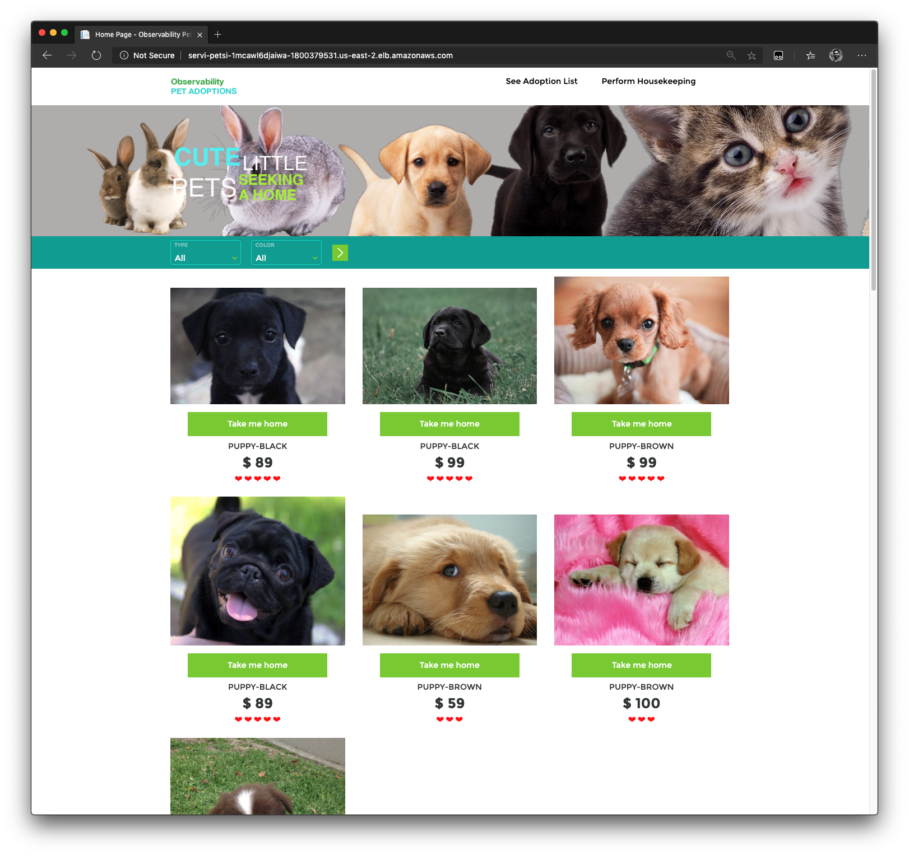
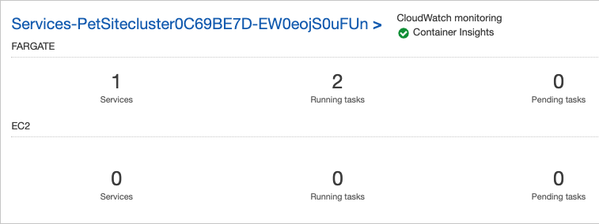
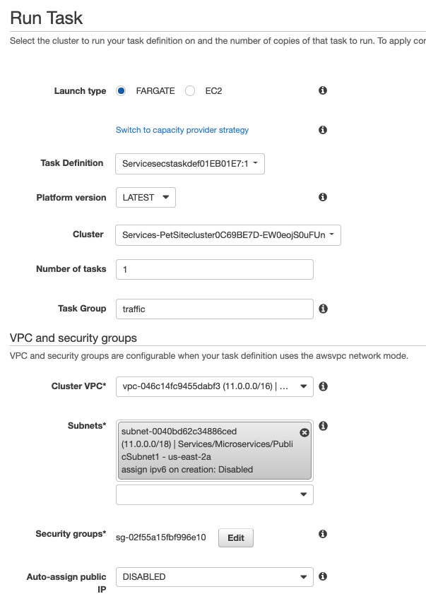
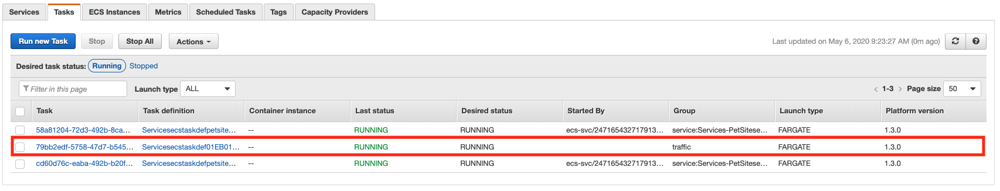
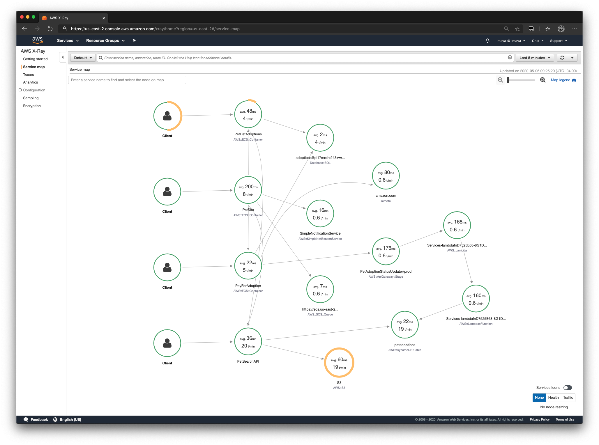

## Test the application

### Manual test
Open the browser and paste the value of Services.PetSiteserviceServiceURL from Outputs which you saved earlier. This should take you to a screen as shown below.

Now go ahead and play around with the application, click all the links you see on screen a few times to generate manual traffic.

### Setup traffic generator (Optional)

As part of the CDK deployment, we also created a ECS Fargate task definition that can be used to automatically generate traffic to this site.

Follow the instructions below to start the task which will generate the traffic for you:
* Go to [ECS Clusters](https://us-east-2.console.aws.amazon.com/ecs/home#/clusters)
* Select the PetSite cluster as shown below

* Go to Tasks tab  and click on **Run new task**

* In the Run Task screen select options as shown below using the Task definition that has the **pet-trafficgenerator** container in it. Ensure you select the VPC that was created as part of the VPC.

* Click **Run Task** and wait for 30 seconds until the task shows **RUNNING** in GREEN

### Service map on X-Ray
Go to [AWS X-Ray Service map screen](https://us-east-2.console.aws.amazon.com/xray/home#/service-map)
You should be able to see a service map as shown below. 

## Go back to main
[Instructions here](../README.md)